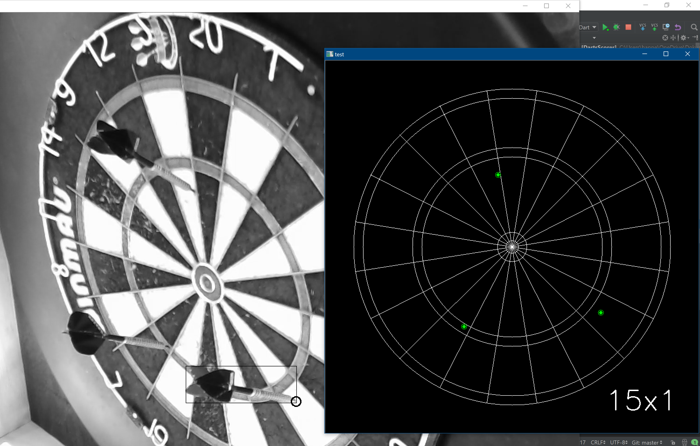
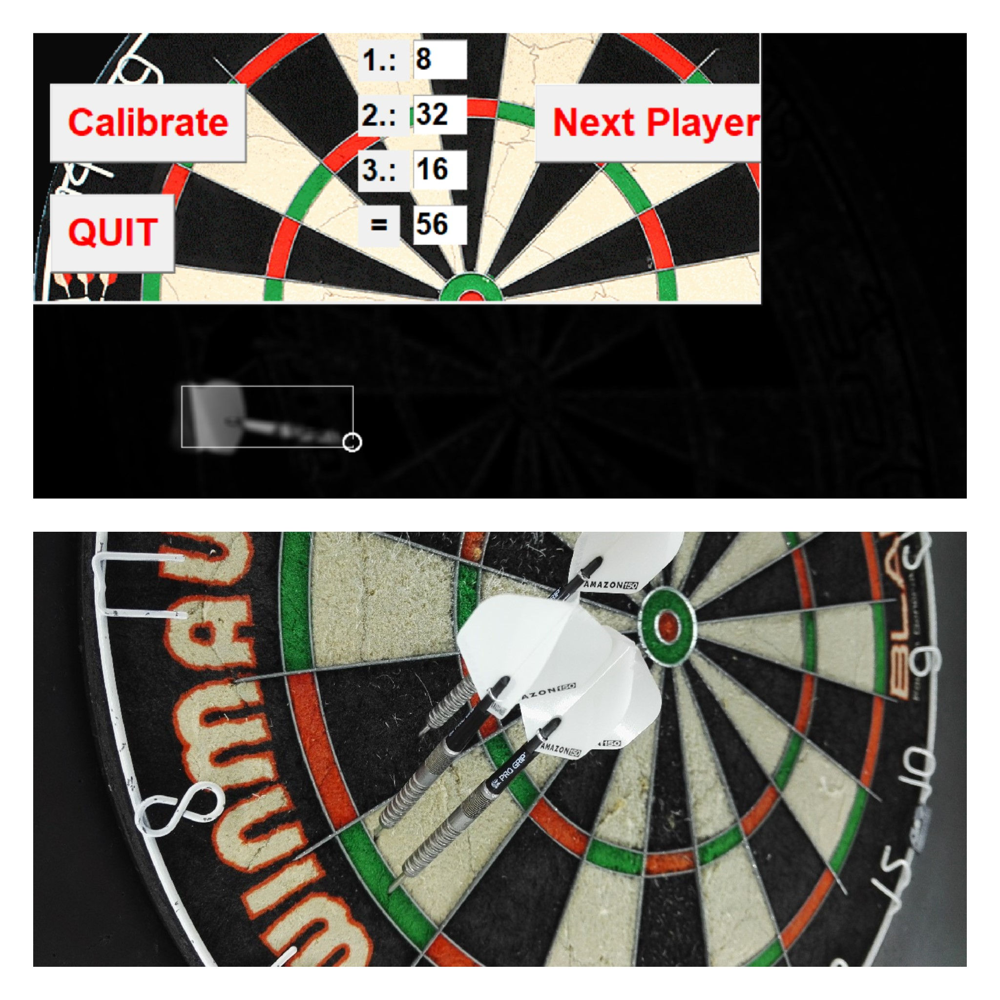
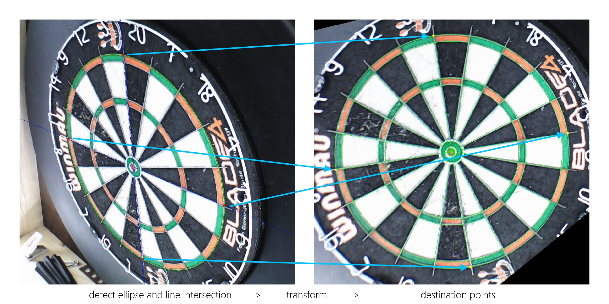
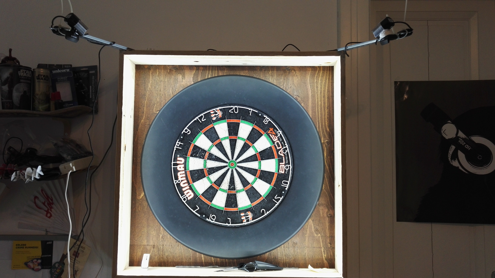

# opencv-steel-darts
Automatic scoring system for steel darts using OpenCV, a Raspberry Pi 3 Model B and two webcams.

This software is under heavy development. It is not ready to work out of the box...(has to be cleaned up and further improved)!

Main entry point is *DartsScorer_1.py* (*DartsScorer.py* is an older version with one camera only).

Watch a demo of the setup here: https://www.youtube.com/playlist?list=PLqymqC7nbI7an1dZW1kxbPPd-v0t5l6lF

Detected darts with score mapping and a Test-GUI to play simple 501:

 

I would like to point to this project as well. Two camera system but placed at the side of the board using triangulation:
https://github.com/vassdoki/opencv-darts

We have created a Facebook Group, where we discuss our current progress and try to help each other:
https://www.facebook.com/groups/281778298914107/

### ToDo: 
* create virtualenv for easy setup process
* improve calibration routine
* improve processing performance with second camera (USB bandwidth issue?)
* clean up and restructure the code!
* integrate GUI from https://github.com/IPeter/darts-go`

## Calibration

Short description of the method: 
1. Find ellipse (green) and the segment lines (blue) 
2. create transformation matrix to transform ellipse to circle in the ellipse center 
3. use transformation matrix to map the blue lines to the circle space
4. find the intersection points of the red line and the circle 
5. use the inverse transformation matrix to transform the intersection points back to the ellipse (red dots) 
6. use the yellow dots as source points to create a transformation matrix to the known destination points (segment circle intersection of the "perfect" dartboard...) 


The lines are found using HoughLines and then filtered in a specific angle range (axis of ellipse).


Image Pre-processing:
```python
imCalHSV = cv2.cvtColor(image_proc_img, cv2.COLOR_BGR2HSV)
kernel = np.ones((5, 5), np.float32) / 25
blur = cv2.filter2D(imCalHSV, -1, kernel)
h, s, imCal = cv2.split(blur)

ret, thresh = cv2.threshold(imCal, 140, 255, cv2.THRESH_BINARY_INV)

# removes border wire outside the outerellipse
kernel = np.ones((5, 5), np.uint8)
thresh2 = cv2.morphologyEx(thresh, cv2.MORPH_CLOSE,kernel)
# find enclosing ellipse
Ellipse, image_proc_img = findEllipse(thresh2,image_proc_img)
```


The transformation works like that (reading from right to left):

			M=T2⋅R2⋅D⋅R1⋅T1
			
1. moves the ellipse-center to the origin
2. rotates the ellipse clockwise about the origin by angle θ, so that the major axis lines up withthe x-axis.
3. scales the y-axis up so that it's as fat in y as in x.
4. rotates counterclockwise by θ.
5. translates the ellipse-center back to where it used to be.

(https://math.stackexchange.com/questions/619037/circle-affine-transformation)

**The same procedure applies for the left camera!**

### Calibrated board



## Darts Detection

*insert text here (short version: To detect the dart I use the diff between images and then the goodfeaturestotrack method from opencv with some pre-and post-processing methods + score merging of both cameras).

## Important

* Dartboard sector wires need to be removed with a filter to find ellipse.
* Dartboard: text close to outer wire of double ring bad for calibration as the contours overlap with the wire with a specific camera mounting (had to remove it manually with a black pen)
* Make source and destination point selection for the found points to be sure the mapping is correct? If the camera is placed differently, other segments are detected as the source points for the transformation.

## Lighting 

To remove all shadows from the board I made a cabinet with a 360 degree surrounding LED stripe.
I will add more pictures of the construction plan or a instruction on how to build the cabinet later.



## License
GNU General Public License v3.0
